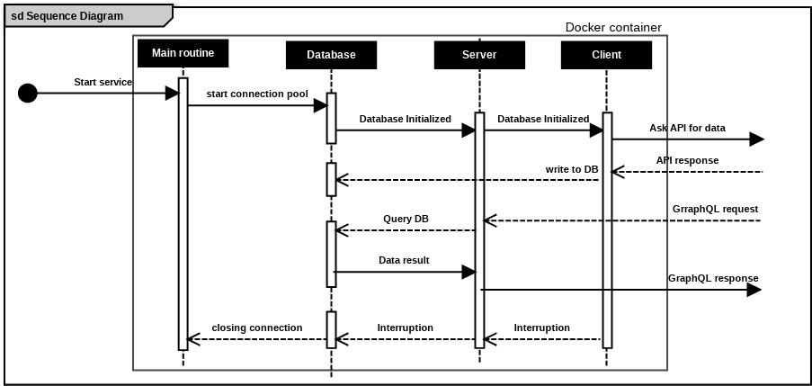

## Welcome to MB data

a GraphQL API to query data about positions and units of **Metrobus** in CDMXm

### General workflow of application

main function is a coroutine context, allowing to span multiple processes bound to IO, and automatically alternate
processing between them, locking threads and syncing resources, once database pool is active, two processes are spawned,
the server and a client for retrieving remote content, these two coroutines write and read alternately from resources in
a non-blocking event loop of their own retrieval of data is suspended and restarted without affecting the server

### Stack

this application was built using Ktor, a multiplatform web framework for Kotlin and deployed to Herocku on a docker
conttainer builds and deployments are automated using github actions

### Explore the API

click [here](https://mb-data.herokuapp.com/graphql) to go see the playgroud, or simply send a post request to
https://mb-data.herokuapp.com/graphql
